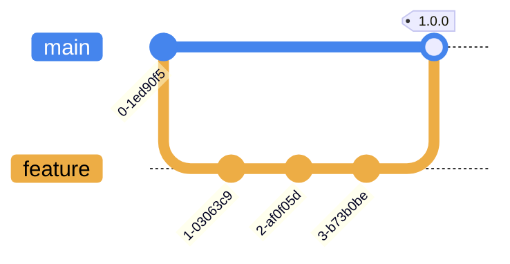

# call-centre-data-terraform

Infrastructure code for the provisioning of object storage for call centre data (call recordings, emails, and metadata).

## Overview

An S3 bucket is provisioned for the storage of call centre data, along with an IAM 'accessor' user with a read-only policy and AWS access key credentials that are intended for use with client applications such as AWS CLI, [WinSCP](https://winscp.net/eng/index.php), or [Cyberduck](https://cyberduck.io/).

Data is encrypted at rest using [server-side encryption](https://docs.aws.amazon.com/AmazonS3/latest/userguide/UsingServerSideEncryption.html) with Amazon S3 managed encryption keys (SSE-S3). Server-side encryption with AWS Key Management Service (AWS KMS) keys (SSE-KMS) or customer-provided keys (SSE-C) is explicitly blocked via an S3 bucket policy—by denying `PutObject` requests with the `aws:kms` header—to ensure that objects in the S3 bucket use the same server-side encryption method (i.e. SSE-S3).

## Branching Strategy

This project uses a trunk-based branching strategy and infrastructure changes are versioned and applied from the `main` branch after merge via the [infrastructure pipeline](https://github.com/companieshouse/ci-pipelines/blob/master/pipelines/ssplatform/team-platform/call-centre-data-terraform):

## License

This project is subject to the terms of the [MIT License](/LICENSE).
